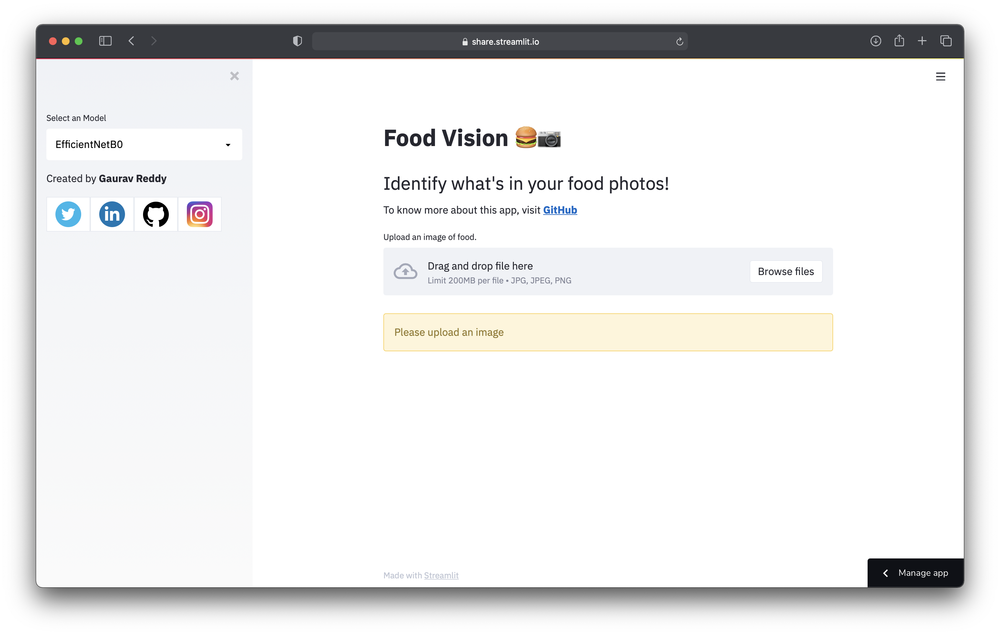

# Food Vision :hamburger: :camera:

As an introductory project to myself, I built an end-to-end **CNN Image Classification Model** which identifies the food in your image. 

I worked out with a Pre-Trained Image Classification Model that comes with Keras and then retrained it on the infamous **Food101** Dataset.

### Fun Fact 

The Model actually beats the [**DeepFood**](https://arxiv.org/pdf/1606.05675.pdf) Paper's model which also trained on the same dataset.

The Accuracy of DeepFood was **77.4%** and out models it **78.4%** . Difference of **1%** ain't much but the interesting is, DeepFood's model took **2-3 days** to train while our's barely took **30min**.

> ###### **Dataset used :**  **`Food101`**

> ###### **Models Used :** **`EfficientNetB0`** ,  **`InceptionNetV3`**

## Looks Great, How can I use it ?

Finally after training the models, I have exported them as `.hdf5` files and then integrated it with **Streamlit Web App**. 

**Streamlit** turns data scripts into shareable web apps in minutes. 
Once I got the App working on my local device I then deployed it using Streamlit’s invite-only **[sharing feature](https://streamlit.io/sharing)**

### To view the Deployed app, [Click here](https://share.streamlit.io/gauravreddy08/food-vision/main/food-vision/app.py)

> The app may take a couple of seconds to load for the first time, but it works perfectly fine.

Once an app is loaded, 
1. In the sidebar, select a model which you would like to use.
2. Upload an image of food. If you dont have one, use the images from `extras/food-images`
3. Once the image is processed, **Predict** button appears. Click it.
4. Once you click the **Predict** button, the model prediction takes place and the output will be displayed along with model's **Top-5 Predictions**

###                                                                          Video

## Okay Cool, How did you build it ?

> If you actually want to know the Nuts and Bolts how the model was trained check out **[`model-training.ipynb`]() Notebook**

1. #### Imported Food101 dataset from **[Tensorflow Datasets](tesnorflow datsets)** Module.

2. #### Becoming one with the Data : *Visualise - Visualize - Visualize*

3. #### Setup Global dtype policy to **`mixed_float16`** to take implement of [**Mixed Precision Training**](https://www.tensorflow.org/guide/mixed_precision)

   > Mixed precision is the use of both 16-bit and 32-bit floating-point types in a model during training to make it **run faster** and use **less memory**.

4. #### Building the Model Callbacks 

   As we are dealing with a complex Neural Network (EfficientNetB0) its a good practice to have few call backs set up. Few callbacks I will be using throughtout this Notebook are :

   - **TensorBoard Callback :** TensorBoard provides the visualization and tooling needed for machine learning experimentation

   - **ModelCheckPoint Callback :** Used in conjunction with training  to save a model or weights (in a checkpoint file) at some interval, so the model or weights can be loaded later to continue the training from the state saved.

   - **EarlyStoppingCallback :**  Used to stop training when a monitored metric has stopped improving.

   - **ReduceLROnPlateau :** Reduce learning rate when a metric has stopped improving.

5. #### Building a Feature Extraction Model

   Before Fine tuning, it's best practice to train a feature extraction model with custom top layers. And all other layers as frozen.

6. #### [Fine Tuning](https://www.tensorflow.org/tutorials/images/transfer_learning) our Feature Extracted Model

   Once we have your Feature Extracted Model ready, we can unfreeze the layers and train it on data again.
   
> If you actually want to know the Nuts and Bolts how the model was trained check out **[`model-training.ipynb`]() Notebook**

7. #### Evaluating and Deploying out Model to Streamlit

   Once we have out model ready, its cruicial to evaluate it on our custom data, the data our model has never seen.

   Training and evaluating a model on train, test data is cool but making predictions on our own realtime images is another level.

   Once we are satisfied with the results, we can export the model as a `.hdf5`  which can be used in future for model deployment.

Once the model is exported then there comes the Deployment part. Check out  **[`app.py`](https://github.com/gauravreddy08/food-vision/blob/main/food-vision/app.py)** to get more insight on How I integrated it with Streamlit.

## Breaking down the repo

At first glance the files in the repo may look intimidating and overwhelming. To avoid that, here is a quick guide :

* `.gitignore` : tells what files/folders to ignore when committing
* `app.py`  : Our Food Vision app built using Streamlit
* `utils.py`  : Some of used fuctions in  `app.py`
* `model-training.ipynb`  : Google Colab Notebook used to train the models
* `model/`  : Contains all the models used as *.hfd5* files
* `requirements.txt`  : List of required dependencies required to run `app.py`
* `extras/`  : Has some miscellaneous images and files used to write this README Document

## Questions ?

Post your queries on the [Issues](https://github.com/gauravreddy08/food-vision/issues) tab, else contact me : gauravreddy008@gmail.com

> *Inspired by **Daniel Bourke's** CS329s Lecture*

